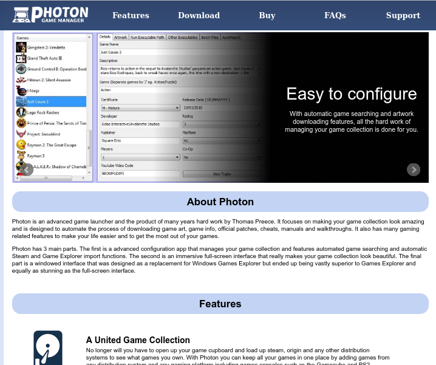
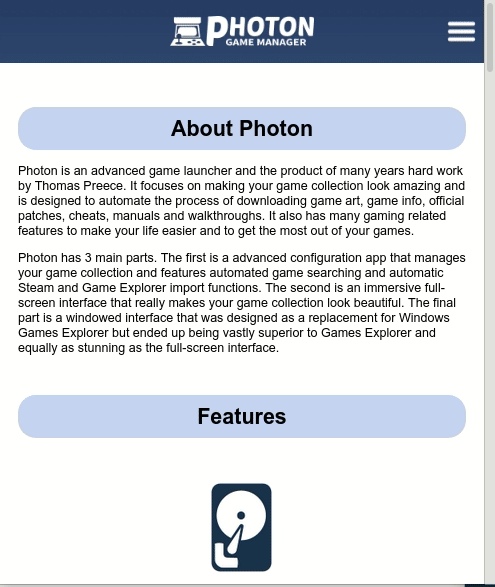

# photongamemanager.com

## About

Source code for PhotonGameManager website which was created around 2013. The website was designed to show off the Photon Game Manager program. It is a fairly simple website with very little server-side scripting and user-side scripting but does exactly what it was designed for and does it well. The site uses a minimal amount of 3rd party Javascript dependencies and scales nicely for a variety of screen sizes. It originally also featured PayPal integration, discount codes and Instant Payment Notification to validate payments but they have since been removed. All icons on the homepage were designed and created by myself in InkScape.

## Gifs 

photongamemanager.com homepage video on desktop:

photongamemanager.com homepage video on mobile:

